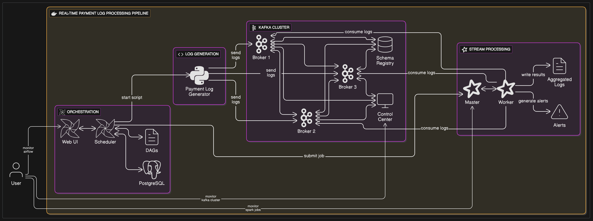

# Logs Real-Time Processing

This project implements a real-time log processing pipeline for e-commerce payment and refund events. It uses Apache Kafka for message streaming, Apache Spark for stream processing, and Apache Airflow for orchestration. The pipeline generates synthetic logs, processes them in real-time, and provides aggregated insights and alerts.

## Features

- **Log Generation**: Simulates payment and refund events with realistic data using `Random` and `Faker` libraries.
- **Real-Time Processing**: Processes logs in real-time using Apache Spark.
- **Alerts**: Generates alerts for high error rates or unusual activity.
- **Orchestration**: Manages the pipeline using Apache Airflow.
- **Scalable Architecture**: Built with Docker and Docker Compose for easy deployment and scalability.


## Project Structure



## Architecture

The pipeline consists of the following components:

1. **Log Generator**: A Python script that generates synthetic logs and sends them to a Kafka topic to simulate payment and refund events.
2. **Kafka Cluster**: A distributed message broker for streaming logs.
3. **Schema Registry**: Manages schemas for Kafka messages to ensure compatibility.
4. **PySpark**: Processes logs in real-time, aggregates data, and generates alerts.
5. **Airflow**: Orchestrates the pipeline, ensuring all components are running and healthy.
6. **Control Center**: Provides a web-based interface for monitoring the Kafka cluster.

## Prerequisites

- Linux-based machine, since airflow is using the host machine docker socket to interact with the containers (Note: This is mandatory for the pipeline to work)
- Docker and Docker Compose installed on your system.
- `Make` installed for easy command execution. (Note: incase of using direct docker command make sure to run all commands in "start-pipeline" section because "docker compose up" alone will not work)

## Setup & Run Instructions

### 1. Clone the Repository

```bash
git clone https://github.com/WadyOsama/Logs-Real-Time-Processing
cd Logs-Real-Time-Processing
```

### 2. Build and Start the Pipeline

Use the provided `Makefile` for managing the pipeline:

```bash
make start-pipeline
```

This will:
- Start all Docker containers (Kafka, Spark, Airflow, etc.).
- Initialize the Airflow database and create an admin user.

### Note:
- In case you want to use docker commands instead of make you should run the flowing commands:
```bash
chmod -R 777 *
docker compose up -d
docker compose --profile manual create
``` 

### 3. Access Services

- **Kafka Control Center**: [http://localhost:9021](http://localhost:9021)
- **Airflow Web UI**: [http://localhost:8070](http://localhost:8070)
  - Username: `admin`
  - Password: `admin`
- **Spark Master UI**: [http://localhost:8080](http://localhost:8080)

### 4. Stop the Pipeline

To stop all services, run:

```bash
make stop-pipeline
```

### Note:
- In case you want to use docker commands instead of make you should run the flowing commands:
```bash
docker compose --profile manual down
docker compose down --remove-orphans
```

## Usage

### Log Generation

The `log-generator` service generates synthetic logs and sends them to the Kafka topic `payment`. Logs include payment and refund events with realistic data.

### Real-Time Processing

The Spark application processes logs in real-time:
- Aggregates data over 1-minute windows.
- Writes aggregated data to CSV files.
- Generates alerts for high error rates or unusual activity.

### Orchestration

Airflow orchestrates the pipeline:
- Ensures the Kafka topic exists.
- Starts the log generator and Spark job.
- Monitors the health of all components.

### Monitoring

- Use the Kafka Control Center to monitor Kafka topics and messages.
- Use the Spark Master UI to monitor Spark jobs and streaming queries.
- Use the Airflow Web UI to monitor DAG runs and task statuses.

## Project File Structure

```
Logs-Real-Time-Processing/
├── airflow/                    # Airflow Data and configuration
│   ├── dags/                   # Airflow DAGs
│   │   └── stream_orch_dag.py  # Airflow Pipeline DAG
│   ├── logs/                   # Airflow logs
│   ├── plugins/                # Airflow plugins
│   └── postgres_data/          # PostgreSQL data for Airflow
├── kafka/                      # Kafka data and configuration
│   ├── kafka1-data/
│   ├── kafka2-data/
│   └── kafka3-data/
├── log-generator/              # Log generator configuration
│   ├── Dockerfile              # Dockerfile for log generator container
│   ├── log_generator.py        # Python script for log generation
│   └── requirements.txt        # Requirements for log generator
├── spark/                      # Spark configuration and data
│   ├── Dockerfile              # Dockerfile for Spark container
│   ├── additional-jars/        # Additional JARs for Spark
│   ├── spark-apps/             # Spark applications
│   │   ├── requirements.txt    # Requirements for Spark applications
│   │   └── stream_processing.py    # Spark application
│   └── spark-data/             # Spark data and checkpoints
│       ├── data/               # Data files
│       │   ├── aggregated_logs/    # Aggregated logs
│       │   └── processed_logs_hourly/  # Hourly processed logs
│       └── spark_checkpoints/  # Spark checkpoints
├── results/                    # Sample results
├── Makefile                    # Commands to manage the pipeline
├── docker-compose.yml          # Docker Compose configuration
└── README.md                   # Project documentation
```

## Customization

### Modify Log Generation

Edit `/log-generator/log_generator.py` to customize the log generation logic, such as event types or data pools.

### Add New Spark Jobs

Add new PySpark scripts to `/spark/spark-apps/` and update the Airflow DAG to submit them.

### Extend Airflow DAGs

Edit `/airflow/dags/stream_orch_dag.py` to add new tasks or workflows.

## Troubleshooting

- **Kafka Broker Unreachable**: Ensure the Kafka brokers are healthy using `docker logs kafka1`.
- **Spark Job Fails**: Check the Spark Master UI for error logs.
- **Airflow Issues**: Check the Airflow logs in `/airflow/logs`.